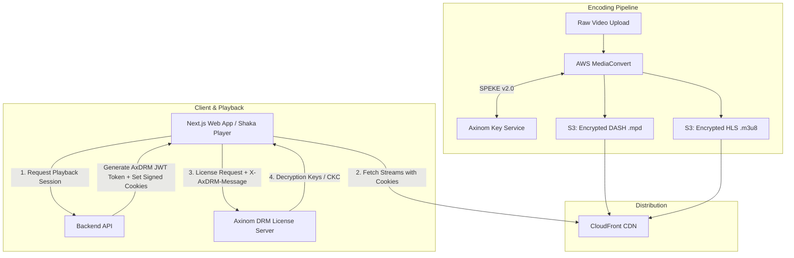

# Building Multi-DRM Video Streaming with AWS MediaConvert, Axinom, and Shaka Player: Architecture, Gotchas, and Hard-Won Lessons

*A deep dive into implementing production-grade Multi-DRM (Widevine, PlayReady, and Apple FairPlay) across DASH and HLS, the subtle pitfalls of Safari EME, and how to conquer common DRM errors.*

---

## 1. Introduction & The Goal

Delivering premium encrypted video across all modern platforms requires a **Multi-DRM strategy**:
- **Widevine Modular** (Google Chrome, Firefox, Android, Android TV)
- **PlayReady** (Microsoft Edge, Windows)
- **FairPlay Streaming (FPS)** (Apple Safari, iOS, iPadOS, macOS)

To protect content, our media pipeline encodes raw video into **DASH (CENC)** and **HLS (SAMPLE-AES)** using **AWS MediaConvert**, integrated with **Axinom DRM Key & Licensing Service via SPEKE v2.0**.

While the high-level architecture seems straightforward on paper, bridging cloud encoding, tokenized license issuance, CloudFront signed cookies, and client-side player execution in Shaka Player presented complex, low-level integration hurdles.

---

## 2. High-Level Architecture Overview



---

## 3. The Challenges & Engineering Battlegrounds

### Challenge 1: The Infamous Shaka Error 4044 (`HLS_AES_128_INVALID_KEY_LENGTH`)

#### The Problem:
When loading the HLS master playlist on Safari or Chrome, the player threw `Shaka Error 4044` when encountering the `#EXT-X-KEY` tag:
```text
#EXT-X-KEY:METHOD=SAMPLE-AES,URI="skd://18ee480b-90a7-4c0d-85bf-334b5378bacd:6BE40FA70DD3E2972C153A920213E71E",KEYFORMAT="com.apple.streamingkeydelivery",KEYFORMATVERSIONS="1",IV=0x...
```

#### Root Cause:
The player attempted to process the stream as clear AES-128 or unhandled clear key encryption rather than routing the initialization data to the Apple FairPlay EME (`com.apple.fps`) key system.

#### Solution:
- Explicitly configure `drm.servers["com.apple.fps"]` and `drm.advanced["com.apple.fps"]`.
- Direct Safari to HLS (`application/x-mpegURL`) and Chromium/Firefox browsers to DASH (`application/dash+xml`), ensuring each browser uses its native DRM engine.

---

### Challenge 2: The `skd://` Content ID Extraction Trap

#### The Problem:
Axinom's FairPlay License Server returned HTTP 400/500 errors when attempting to generate a Server Playback Context (SPC) response.

#### Root Cause:
AWS MediaConvert outputs HLS manifests formatted with both the Content ID and Key ID separated by a colon:
```text
URI="skd://18ee480b-90a7-4c0d-85bf-334b5378bacd:6BE40FA70DD3E2972C153A920213E71E"
```
When parsing the `initData`, if the application sends the entire `18ee480b-90a7...:6BE40FA7...` string to the license server, the license server fails to locate the asset key because it only recognizes the base UUID (`18ee480b-90a7-4c0d-85bf-334b5378bacd`).

#### Solution:
Shaka Player's built-in FairPlay handler automatically trims and formats the URI if `serverCertificateUri` is provided correctly, eliminating manual regex mangling.

---

### Challenge 3: Certificate CORS Errors on Cloud Storage

#### The Problem:
Safari requires the Apple FairPlay Application Secret Key Certificate (`fairplay.cer`) to generate the licensing challenge. Fetching the `.cer` directly from Azure Blob Storage or S3 caused browser CORS rejection:
```text
Access to fetch at 'https://drmmanagedprod.blob.core.windows.net/.../fairplay.cer' from origin 'http://localhost:3000' has been blocked by CORS policy.
```

#### Solution:
We implemented a Next.js Server Proxy route: `src/app/api/drm/fairplay-cert/route.ts`.

```ts
// src/app/api/drm/fairplay-cert/route.ts
import { NextResponse } from "next/server";

export async function GET() {
  const certUrl = process.env.NEXT_PUBLIC_FAIRPLAY_CERT;
  const res = await fetch(certUrl);
  const buffer = await res.arrayBuffer();

  return new NextResponse(buffer, {
    headers: {
      "Content-Type": "application/octet-stream",
      "Access-Control-Allow-Origin": "*",
      "Cache-Control": "public, max-age=86400",
    },
  });
}
```

---

### Challenge 4: CORS Rejection with CloudFront Signed Cookies (`allowCrossSiteCredentials`)

#### The Problem:
To protect raw video segments, we use CloudFront Signed Cookies (`CloudFront-Policy`, `CloudFront-Signature`, `CloudFront-Key-Pair-Id`). Enabling cross-site credentials globally on the Shaka `NetworkingEngine` broke external DRM license requests:
```ts
// ❌ WRONG: Breaks third-party DRM servers (CORS forbids credentials on wildcard origins)
request.allowCrossSiteCredentials = true;
```

#### Solution:
Scope `allowCrossSiteCredentials` strictly to media segments and manifests:

```ts
// ✅ CORRECT: Scoped credentials
player.getNetworkingEngine().registerRequestFilter((type, request) => {
  if (
    type === shaka.net.NetworkingEngine.RequestType.MANIFEST ||
    type === shaka.net.NetworkingEngine.RequestType.SEGMENT
  ) {
    request.allowCrossSiteCredentials = true;
  } else {
    request.allowCrossSiteCredentials = false;
  }
});
```

---

### Challenge 5: Safari Error 3016 & The Missing `PatchedMediaKeysApple` Polyfill

#### The Problem:
On Safari, videos threw `Shaka Error 3016` (`DEMUXER_ERROR_COULD_NOT_PARSE` / `VIDEO_ERROR`). Setting `useNativeHlsForFairPlay: true` handed playback over to Safari's native `<video>` tag, bypassing Shaka's request filter, which meant the required `X-AxDRM-Message` JWT token was never sent with the license request.

#### Root Cause:
Apple's modern WebKit EME implementation has edge-case quirks with multi-key streams. Shaka Player provides a specialized polyfill — `shaka.polyfill.PatchedMediaKeysApple` — to standardize Apple's prefixed WebKit EME layer.

#### Solution:
1. Install both standard polyfills and `PatchedMediaKeysApple`:
   ```ts
   shaka.polyfill.installAll();
   if (shaka.polyfill?.PatchedMediaKeysApple?.install) {
     shaka.polyfill.PatchedMediaKeysApple.install();
   }
   ```
2. Remove `useNativeHlsForFairPlay: true`, letting Shaka's Media Source Extensions (MSE) and EME pipeline manage FairPlay decryption reliably.

---

## 4. The Final Working Player Implementation

Here is the hardened, production-ready Shaka Player setup:

```tsx
import React, { useEffect, useRef } from "react";
import shaka from "shaka-player";

export const VideoPlayer = ({ src, drmConfig }) => {
  const videoRef = useRef<HTMLVideoElement>(null);

  useEffect(() => {
    // 1. Install polyfills including Apple FairPlay EME patch
    shaka.polyfill.installAll();
    if (shaka.polyfill?.PatchedMediaKeysApple?.install) {
      shaka.polyfill.PatchedMediaKeysApple.install();
    }

    const video = videoRef.current;
    if (!video || !shaka.Player.isBrowserSupported()) return;

    const player = new shaka.Player();
    player.attach(video);

    // 2. Configure DRM servers & Certificate
    player.configure({
      drm: {
        servers: {
          "com.apple.fps": process.env.NEXT_PUBLIC_FAIRPLAY_URL,
          "com.widevine.alpha": process.env.NEXT_PUBLIC_WIDEVINE_URL,
          "com.microsoft.playready": process.env.NEXT_PUBLIC_PLAYREADY_URL,
        },
        advanced: {
          "com.apple.fps": {
            serverCertificateUri: "/api/drm/fairplay-cert",
          },
        },
      },
    });

    // 3. Register Request Filters for Authentication
    player.getNetworkingEngine().registerRequestFilter((type, request) => {
      // Allow signed cookies only for CDN video data
      if (
        type === shaka.net.NetworkingEngine.RequestType.MANIFEST ||
        type === shaka.net.NetworkingEngine.RequestType.SEGMENT
      ) {
        request.allowCrossSiteCredentials = true;
      } else {
        request.allowCrossSiteCredentials = false;
      }

      // Attach DRM Entitlement Token to License Acquisition
      if (type === shaka.net.NetworkingEngine.RequestType.LICENSE && drmConfig?.token) {
        request.headers["X-AxDRM-Message"] = drmConfig.token;
      }
    });

    // 4. Load Stream
    player.load(src).catch((err) => {
      console.error("DRM Playback Error:", err);
    });

    return () => {
      player.destroy();
    };
  }, [src, drmConfig]);

  return <video ref={videoRef} controls autoPlay playsInline className="w-full h-full" />;
};
```

---

## 5. Summary Checklist for DRM Developers

| Step | Requirement | Why It Matters |
| :--- | :--- | :--- |
| **1. Stream Routing** | Serve `.mpd` (DASH) to Chrome/Firefox/Edge, `.m3u8` (HLS) to Safari. | Matches each browser's native hardware DRM capabilities. |
| **2. Polyfills** | Call `shaka.polyfill.PatchedMediaKeysApple.install()`. | Avoids Safari demuxer and EME initialization failures. |
| **3. Certificate Proxy** | Proxy `.cer` files through your Next.js backend. | Eliminates cross-origin CORS blocks on Apple certificates. |
| **4. Scoped Credentials** | Keep `allowCrossSiteCredentials = false` for DRM license URLs. | Prevents third-party licensing endpoints from rejecting preflights. |
| **5. Clean Token Headers** | Pass `X-AxDRM-Message: <JWT>` on license requests. | Authenticates entitlement against Axinom DRM services. |

---

*Multi-DRM implementation requires precise orchestration across encoding, token security, CDN rules, and player runtime. By understanding the EME lifecycle and configuring polyfills correctly, you can achieve smooth, studio-grade video playback across every device.*
